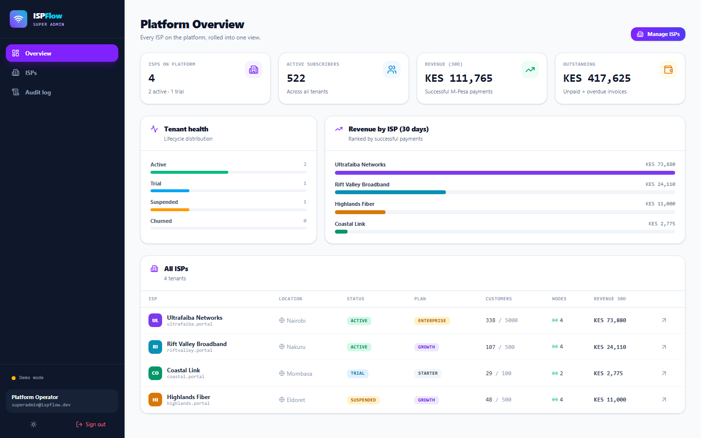
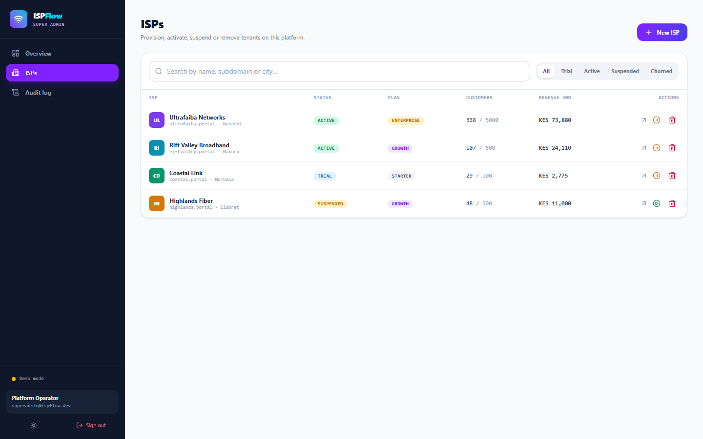
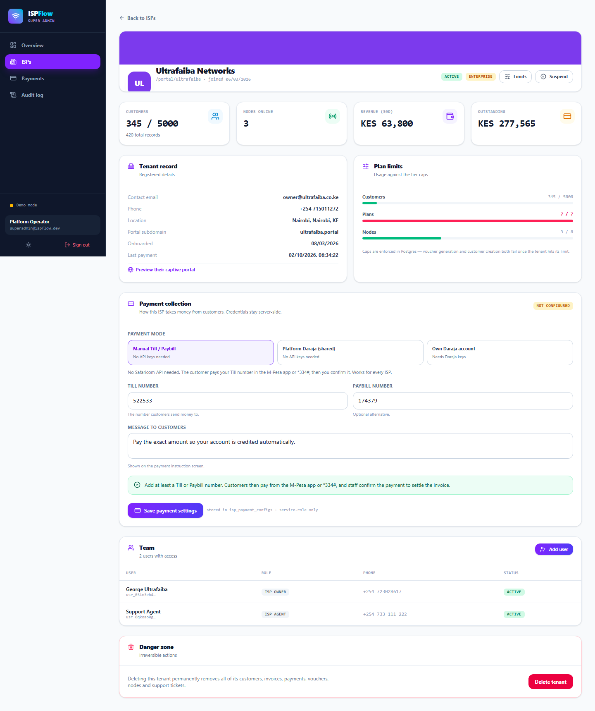
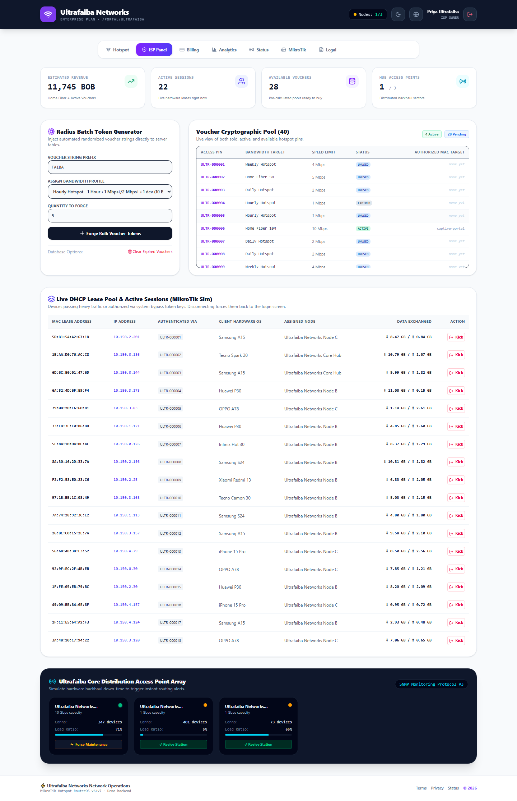

# ISPFlow — Multi-tenant ISP Hotspot Billing Platform

**One super admin. Every ISP. Fully isolated.**

Run hotspot billing, M-Pesa collection and MikroTik operations for many ISPs
from a single platform — with tenant isolation enforced by Postgres Row Level
Security, not by convention.

```
React 19 + Vite 7 + TypeScript 5.9 + Tailwind 4
        ↓
Supabase (Postgres · Auth · RLS · Edge Functions)
        ↓
Safaricom Daraja (M-Pesa STK Push)
```

---

## Quick start

```bash
npm install
npm run dev
```

Open **<http://localhost:5173>**.

No backend, no database, no configuration. The app boots in **demo mode** — a
localStorage simulation of the whole platform with four seeded tenants. Every
screen is fully interactive.

| Role        | Email                    | Password     |
| ----------- | ------------------------ | ------------ |
| Super admin | `superadmin@ispflow.dev` | `Super@1234` |
| ISP owner   | `owner@ultrafaiba.co.ke` | `Owner@1234` |

The login screen has one-click buttons for both. Full setup instructions live
in **[DEPLOYMENT.md](./DEPLOYMENT.md)**.

---

## What you can do

### As the super admin (`/admin`)

| Screen | What it does |
| --- | --- |
| **Platform Overview** | Tenants, subscribers, 30-day revenue and outstanding AR across the whole platform; tenant health bars; revenue ranking; churn-risk alerts |
| **ISPs** (`/admin/isps`) | Search and filter tenants, create new ones, change tier and limits, suspend, reactivate, delete |
| **Tenant detail** (`/admin/isps/:id`) | Contact record, usage against plan caps, team list, invite staff, suspend/delete |
| **Audit log** (`/admin/audit`) | Every privileged action with actor, role, tenant and payload |

### As an ISP (`/app`)

| Screen | What it does |
| --- | --- |
| **ISP Panel** | Bulk voucher generation, session control, node status, expired-voucher cleanup |
| **Hotspot** | Captive portal preview and voucher redemption |
| **Billing** | Customer invoices, M-Pesa STK Push, plan upgrades, support tickets |
| **Analytics** | Traffic, revenue and usage charts |
| **Status** | Network node health |
| **MikroTik** | RouterOS script generator (PPPoE, hotspot, firewall) |
| **Legal** | Terms, privacy, AUP, refund policy, SLA |

### Publicly

`/portal/<slug>` — a per-tenant branded captive portal. No login: the voucher
is the credential. This is what your MikroTik redirects customers to.

---

## Screenshots

| | |
| --- | --- |
|  |  |
| **Super admin — platform KPIs and tenant table** | **Super admin — tenant lifecycle management** |
|  |  |
| **Super admin — tenant detail and limits** | **ISP owner — operations panel** |

---

## Multi-tenancy & security

Tenant isolation is enforced **in the database**, not in the UI. Every business
table carries an `isp_id` and a `FORCE ROW LEVEL SECURITY` policy:

```sql
create policy plans_read on public.plans for select using (
  public.is_super_admin() or isp_id = public.current_isp_id()
);
```

### Roles

| Role | Scope |
| --- | --- |
| `super_admin` | Every tenant; reads `audit_logs`; manages payment configs |
| `isp_owner` | Own tenant; can edit its record |
| `isp_admin` | Own tenant; full operational access |
| `isp_agent` | Own tenant; support access only |
| `client` | Read-only access to their own account, invoices and tickets |

### M-Pesa credentials never reach the browser

Daraja consumer keys and passkeys live in `isp_payment_configs`, readable only
by the service role. The `stk-push` Edge Function reads them server-side and
performs the API call. The old build had them hardcoded in client code, which
published them to anyone who opened DevTools — that is fixed.

> The Supabase **anon key** *is* meant to be public. RLS is what protects your
> data, not key secrecy.

---

## Project structure

```
src/
  lib/
    config.ts          live vs demo mode detection
    supabase.ts        client + Edge Function helpers
    types.ts           domain models mirroring the Postgres schema
    data.ts            unified data access (Supabase or demo store)
    demoStore.ts       localStorage platform simulation
    adapters.ts        domain models → legacy view shapes
  context/             Auth, Theme, Tenant data providers
  pages/
    admin/             super admin panel
    isp/               tenant workspace
    CaptivePortal.tsx  /portal/:slug
  components/ui/       shared primitives
supabase/
  migrations/          schema, RLS policies, RPC functions
  functions/           stk-push · stk-callback · admin-invite
deploy/                nginx config for the VPS image
e2e/                   Playwright smoke tests
```

---

## Commands

| Command | Purpose |
| --- | --- |
| `npm run dev` | Dev server on :5173 |
| `npm run build` | Typecheck + production build |
| `npm run typecheck` | TypeScript only |
| `npm test` | 23 unit/behavioural tests (Vitest) |
| `npm run test:e2e` | 7 browser tests (Playwright) |

---

## Deployment

| Target | Status | Config |
| --- | --- | --- |
| **Localhost** | ✅ Works now | `npm run dev` — demo mode needs nothing |
| **Supabase** | ✅ Ready | 3 migrations + 3 Edge Functions, see [DEPLOYMENT.md](./DEPLOYMENT.md) |
| **Vercel** | ✅ Ready | `vercel.json` — SPA rewrites, caching, security headers |
| **VPS / Docker** | ✅ Ready | `Dockerfile` + `docker-compose.yml` + `deploy/nginx.conf` |

```bash
# Vercel
vercel --prod

# VPS
cp .env.example .env && docker compose up -d --build
```

### What do I need to provide?

See **[SETUP_CHECKLIST.md](./SETUP_CHECKLIST.md)** — the short version is a
Supabase project URL, the `anon` key, and your operator email. Everything else
the platform creates for itself.

---

## Testing

```bash
npm test        # tenant isolation, plan limits, cascade deletes,
                # voucher lifecycle, audit trail
npm run test:e2e   # both roles, captive portal, routing, 404s
```

---

## License

MIT — see [LICENSE](./LICENSE).

## Security

See [SECURITY.md](./SECURITY.md).