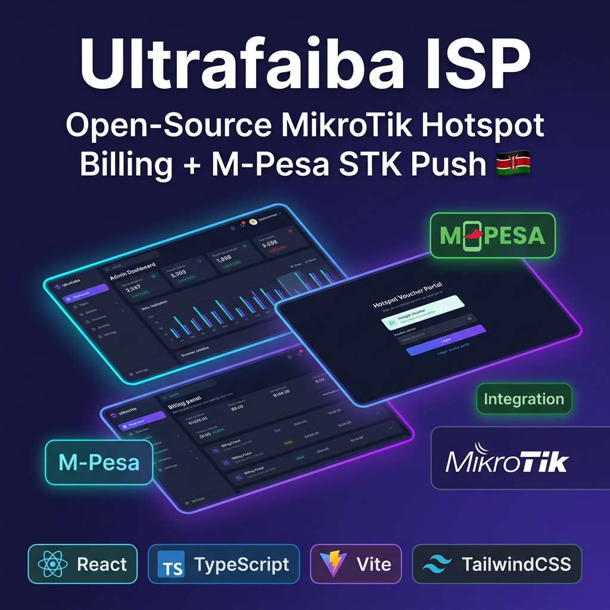

<div align="center">



# 🌐 Ultrafaiba — ISP Hotspot Billing System

### The **#1 open-source** billing & management platform for MikroTik hotspots — with **M-Pesa STK Push** 🇰🇪

[](LICENSE)
[](https://react.dev)
[](https://typescriptlang.org)
[](https://vitejs.dev)
[](https://tailwindcss.com)
[](CONTRIBUTING.md)
[](https://github.com/Jobkizz/isp-hotspot-billing/stargazers)
[](https://github.com/Jobkizz/isp-hotspot-billing/network)

<br/>

**[🚀 Live Demo](https://ultrafaiba.net)** &nbsp;·&nbsp; **[📖 Setup Guide](#-getting-started)** &nbsp;·&nbsp; **[🐛 Report Bug](https://github.com/Jobkizz/isp-hotspot-billing/issues/new?template=bug_report.md)** &nbsp;·&nbsp; **[✨ Request Feature](https://github.com/Jobkizz/isp-hotspot-billing/issues/new?template=feature_request.md)**

<br/>

> ⭐ **If this project saves you weeks of work, please star it!** Stars help other ISPs in Africa discover this tool.

</div>

---

## 🎯 What is this?

**Stop building hotspot billing from scratch.**

This is a **complete, production-ready billing and management system** for ISPs running MikroTik hotspots anywhere in Africa. It solves the #1 pain point for small ISPs: collecting payments and managing access automatically.

Clone → Configure → Go Live in **under 10 minutes**.

```
✅ M-Pesa STK Push     ✅ MikroTik Voucher Engine    ✅ Admin Dashboard
✅ Client Billing Portal  ✅ Real-time Analytics      ✅ Network Status Monitor
✅ RouterOS Script Gen    ✅ Live Support Chat         ✅ ISP Legal Pages
```

---

## ✨ Features at a Glance

| Feature | Description | Status |
|---|---|---|
| 🔐 **Hotspot Login Portal** | Custom MikroTik-compatible login page with voucher & phone auth | ✅ Live |
| 💳 **M-Pesa STK Push** | Automated payment collection via Safaricom Daraja API | ✅ Live |
| 📊 **Admin Dashboard** | Real-time overview of clients, revenue, sessions & network | ✅ Live |
| 🧾 **Client Billing Portal** | Invoices, payment history, plan upgrades, support tickets | ✅ Live |
| 📡 **Network Status** | Live health monitoring across all your nodes | ✅ Live |
| 📈 **Analytics** | Traffic, revenue, and usage charts | ✅ Live |
| ⚙️ **MikroTik Config Generator** | One-click RouterOS script generation (PPPoE, Hotspot, Firewall) | ✅ Live |
| 🎟️ **Bulk Voucher Engine** | Generate, track and expire voucher batches | ✅ Live |
| 💬 **Live Chat Widget** | Built-in client support with NOC auto-response | ✅ Live |
| 📜 **Legal Pages** | Terms, Privacy Policy, SLA, Acceptable Use, Refund — all ISP-ready | ✅ Live |
| 🌙 **Dark Mode** | Full dark/light mode toggle | ✅ Live |
| 🌍 **Multi-Currency** | Configurable for KES, TZS, UGX, GHS and more | 🔜 Roadmap |

---

## 📸 Screenshots

> *(Deploy your live demo and add GIFs here for maximum stars!)*
>
> Tip: Use [ScreenToGif](https://www.screentogif.com/) to record the admin dashboard and billing portal — animated GIFs get **3× more stars** than static screenshots.

---

## 🛠️ Tech Stack

| Layer | Technology |
|---|---|
| **Framework** | React 19 + TypeScript 5.9 |
| **Build Tool** | Vite 7 |
| **Styling** | TailwindCSS 4 |
| **Icons** | Lucide React |
| **Payments** | Safaricom Daraja API (M-Pesa STK Push) |
| **Hotspot** | MikroTik RouterOS v6/v7 compatible |
| **Deploy** | GitHub Pages / Vercel / Netlify (1-click) |

---

## 🚀 Getting Started

### Prerequisites

- **Node.js 18+** → [Download](https://nodejs.org)
- A **MikroTik** router (for hotspot portal integration)
- A **Safaricom Daraja** account (for M-Pesa) → [Register free](https://developer.safaricom.co.ke)

### Installation

```bash
# 1. Clone the repo
git clone https://github.com/Jobkizz/isp-hotspot-billing.git
cd isp-hotspot-billing

# 2. Install dependencies
npm install

# 3. Configure environment variables
cp .env.example .env
# Edit .env with your Daraja API credentials

# 4. Start the development server
npm run dev
```

Open [http://localhost:5173](http://localhost:5173) — you'll see the full admin dashboard instantly.

> **No backend required for the demo.** All UI is fully functional with realistic mock data out of the box.

---

## 🔑 M-Pesa (Daraja API) Configuration

```env
VITE_DARAJA_CONSUMER_KEY=your_consumer_key
VITE_DARAJA_CONSUMER_SECRET=your_consumer_secret
VITE_DARAJA_PASSKEY=your_passkey
VITE_DARAJA_SHORTCODE=174379
VITE_DARAJA_CALLBACK_URL=https://yourdomain.com/api/mpesa/callback
```

📖 Full step-by-step Daraja setup: **[DARAJA_SETUP.md](DARAJA_SETUP.md)**

---

## 📡 MikroTik Hotspot Integration

Upload files from `public/hotspot/` to your MikroTik's hotspot HTML directory:

```routeros
/ip hotspot set login-page=login.html
```

The login page supports:
- **Voucher code** authentication
- **Phone number** authentication (matches M-Pesa payer)

---

## 🗂️ Project Structure

```
├── public/
│   ├── hotspot/              # MikroTik RouterOS hotspot HTML files
│   │   ├── login.html        # Custom captive portal login page
│   │   ├── logout.html
│   │   ├── status.html
│   │   └── style.css
│   └── images/               # Static assets & social preview
├── src/
│   ├── components/
│   │   ├── AdminDashboard.tsx    # ISP admin panel: vouchers, sessions, nodes
│   │   ├── Analytics.tsx         # Revenue & traffic analytics
│   │   ├── ClientBilling.tsx     # Subscriber billing portal + support tickets
│   │   ├── HotspotPortal.tsx     # Captive portal: buy & activate vouchers
│   │   ├── LandingPage.tsx       # Public marketing homepage
│   │   ├── LiveChat.tsx          # Real-time support chat widget
│   │   ├── MikrotikConfig.tsx    # RouterOS script generator (PPPoE/Hotspot)
│   │   ├── NetworkStatus.tsx     # Live node health monitoring
│   │   └── TermsAndConditions.tsx # ISP-ready legal pages (5 tabs)
│   ├── data/
│   │   └── mockData.ts           # Realistic demo data (plans, sessions, nodes)
│   ├── services/
│   │   └── darajaApi.ts          # M-Pesa Daraja API integration
│   └── App.tsx                   # Root app with global state management
├── DARAJA_SETUP.md               # Full Daraja API setup walkthrough
├── CONTRIBUTING.md               # How to contribute
├── SECURITY.md                   # Security policy
└── .env.example                  # Environment variable template
```

---

## 🌍 Who Is This For?

| Who | Why This Helps |
|---|---|
| **ISPs in Kenya, Tanzania, Uganda, Ghana** | M-Pesa & mobile money billing built-in |
| **MikroTik Resellers** | Ready-made billing UI for your clients |
| **Cybercafé & Hotspot Owners** | Timed voucher internet access management |
| **Developers** | Full Daraja API integration example |
| **Students & Bootcamps** | Real-world React + TypeScript project reference |

---

## 🤝 Contributing

Contributions make open source great! **All skill levels welcome.**

See **[CONTRIBUTING.md](CONTRIBUTING.md)** for full guidelines.

### Priority Areas 🔥

- 🌍 **More payment gateways** — Airtel Money, MTN MoMo, Flutterwave, Pesapal
- 📱 **PWA / Mobile App** — React Native or Capacitor wrapper
- 🔐 **Backend Auth** — Supabase or Firebase integration
- 🌐 **i18n** — Swahili, French, Hausa translations
- 🧪 **Tests** — Vitest unit tests for billing logic
- 📊 **More charts** — Revenue forecasting, churn analytics

---

## 🗺️ Roadmap

- [ ] 🔗 Backend API (Node.js / Supabase)
- [ ] 📲 PWA with push notifications
- [ ] 🌍 Multi-currency & multi-language support
- [ ] 🤖 AI-powered network anomaly detection
- [ ] 📡 Live MikroTik API integration (RouterOS REST)
- [ ] 📦 Docker deployment template

---

## 📄 License

Distributed under the **MIT License** — free for commercial and private use. See [LICENSE](LICENSE) for details.

---

## 💬 Support & Contact

| Channel | Details |
|---|---|
| 📧 Email | support@ultrafaiba.net |
| 📞 Phone / M-Pesa | +254 724 167 975 |
| 🐛 Bug Reports | [Open an Issue](https://github.com/Jobkizz/isp-hotspot-billing/issues) |
| ⭐ Star the Repo | [Help other ISPs find this!](https://github.com/Jobkizz/isp-hotspot-billing/stargazers) |

---

<div align="center">

Made with ❤️ in Kenya 🇰🇪

**If this saved you time, [⭐ star this repo](https://github.com/Jobkizz/isp-hotspot-billing/stargazers) — it helps other ISPs in Africa find it!**

[](https://star-history.com/#Jobkizz/isp-hotspot-billing&Date)

</div>
